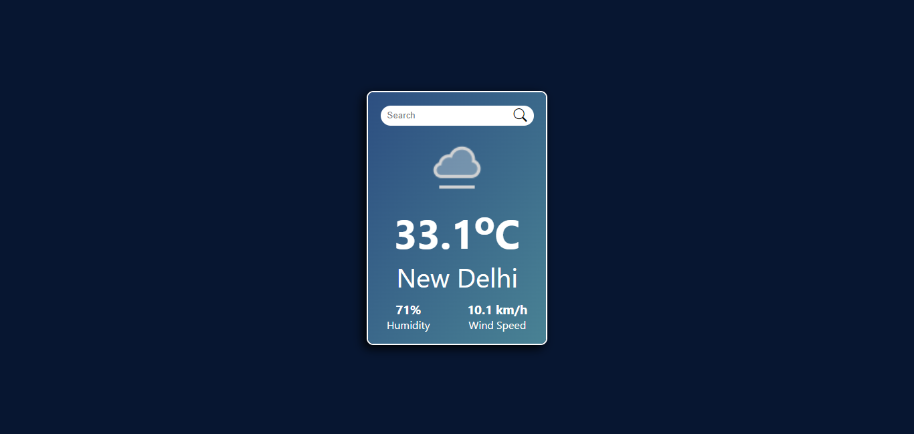

# Weather App 🌤️

## Overview
This **Weather App** is a simple and elegant application built with **React.js**. The app allows users to search for weather information by entering the name of a city. It displays current weather details in a user-friendly and visually appealing UI.

## Features
- 🌍 **Search Functionality:** Search weather data for any city around the globe.
- 📊 **Real-time Weather Information:** Displays current temperature, weather conditions, and more.
- 🎨 **Beautiful UI:** Clean and modern design that provides an intuitive experience.
- 🌤️ **Responsive Design:** Works seamlessly on mobile and desktop devices.

## Installation and Setup

1. **Clone the repository:**
    ```bash
    git clone https://github.com/dpk763/WeatherApp.git
    cd WeatherApp
    ```

2. **Install dependencies:**
    ```bash
    npm install
    ```

3. **Start the application:**
    ```bash
    npm start
    ```

4. Open your browser and visit `http://localhost:3000` to use the app.

## Usage

1. Enter the name of a city in the search bar.
2. Press the search button to fetch the weather data.
3. View the weather conditions including temperature, humidity, wind speed, etc.

## Technologies Used
- **React.js**: For building the user interface.
- **rapidapi API** (or your chosen weather API): To fetch real-time weather data.
- **CSS**: For styling and creating the sleek UI.

## API Integration

This app uses the **rapidapi API** to get the weather data. To make it work, you need to:
1. Get your API key from [rapidapi](https://weatherapi-com.p.rapidapi.com).
2. Create a `.env` file at the root of your project.
3. Add your API key in the `.env` file like this:
    ```bash
    REACT_APP_WEATHER_API_KEY=your_api_key
    ```

## Contributing
Feel free to fork the repository and submit pull requests. Any feedback or suggestions to improve the app is appreciated!


## Preview



